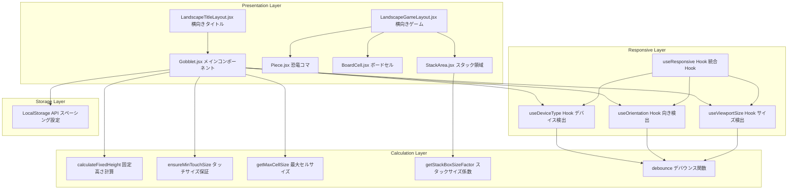
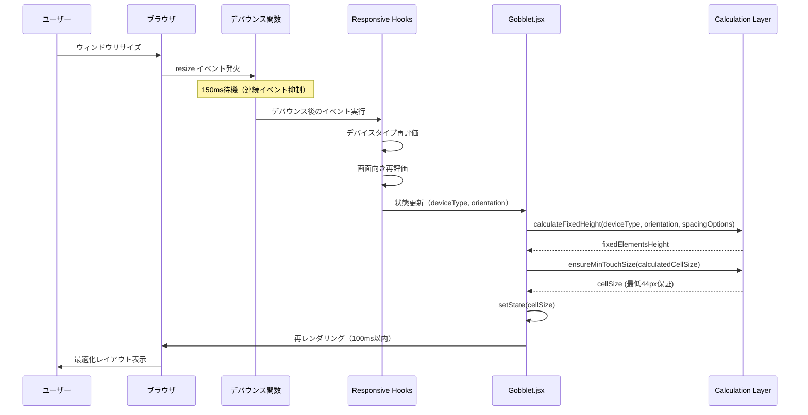
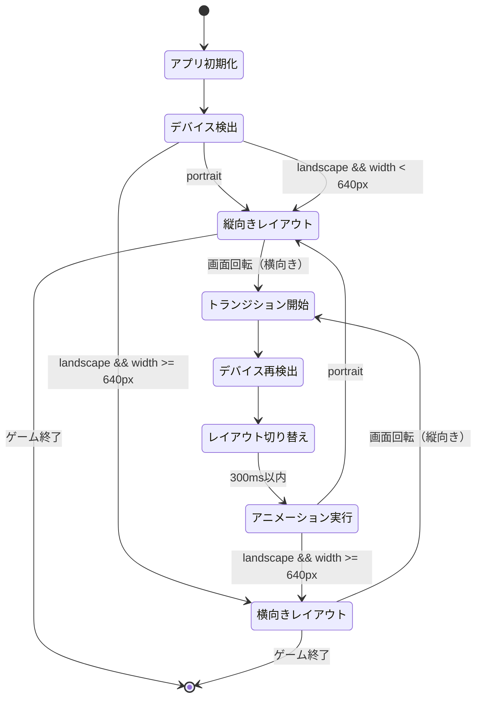

# Technical Design Document: responsive-design

## Overview

本設計書は、GOBBLETゲームアプリケーションのマルチデバイス対応を実現するレスポンシブデザイン機能の技術設計を定義します。本機能は、スマートフォン（縦・横）、タブレット（縦・横）、デスクトップの全デバイスで最適な表示とUXを提供し、動的スペーシングシステム、横向きモードレイアウト、タッチターゲット最適化、ビューポート高さ改善、パフォーマンス最適化を実現します。

**Purpose**: ゲーム利用者に対し、どのデバイス・画面サイズ・向きでも快適なゲーム体験を提供します。

**Users**: モバイルユーザー（iPhone, Android）、タブレットユーザー（iPad, Android Tablet）、デスクトップユーザーが、縦向き・横向きの両方でゲームをプレイできるようになります。

**Impact**: 現在の固定値ベースのスペーシング計算と縦向き専用レイアウトを、デバイス適応型の動的システムと横向きモード対応レイアウトに変更します。既存のゲームロジックとスペーシング設定は後方互換性を維持します。

### Goals
- デバイスタイプ（mobile/tablet/desktop）と画面向き（portrait/landscape）の自動検出と適応
- 画面サイズに応じた動的スペーシング計算とタッチターゲットサイズ保証（最低44px）
- 横向きモードでの最適化レイアウト（2カラム、横並び配置）提供
- リサイズ時のパフォーマンス最適化（デバウンス、メモ化）とレンダリング時間100ms以内達成
- 80%以上のユニットテストカバレッジと全デバイスでの動作保証

### Non-Goals
- ダークモード対応（将来の拡張として考慮）
- アニメーション強化（Framer Motion導入は対象外）
- PWA対応（オフラインプレイ、ホーム画面追加は別仕様）
- マルチプレイヤー機能（画面分割2人プレイは対象外）
- 既存ゲームロジック（AI難易度、勝敗判定）の変更

## Architecture

### Existing Architecture Analysis

本機能は既存システムの拡張であり、以下の既存アーキテクチャパターンと制約を尊重します。

**Current Architecture Patterns**:
- **単一ファイルコンポーネント**: Gobblet.jsx（1,300行超）に全ゲームロジックを集約
- **Custom Hooks分離**: レスポンシブロジック（`useResponsive.js`）を`hooks/`ディレクトリに分離済み
- **Utility関数分離**: 計算ロジック（`calculations.js`）を`utils/`ディレクトリに分離済み
- **LocalStorage永続化**: スペーシング設定を`gobblet-spacing-options`キーで保存
- **インラインスタイル優先**: React style propsで全スタイル定義

**Existing Domain Boundaries**:
- **Presentation Layer**: Gobblet.jsx, Piece, BoardCell, StackArea等のUIコンポーネント
- **Logic Layer**: ゲームロジック（checkWinner, getValidMoves, applyMove等）
- **Responsive Layer**: useDeviceType, useOrientation, useViewportSize Hooks
- **Calculation Layer**: calculateFixedHeight, ensureMinTouchSize, getMaxCellSize等のユーティリティ

**Integration Points to Maintain**:
- LocalStorage API（既存のスペーシング設定との互換性維持）
- ゲーム状態管理（board, stacks, currentTurn等）は変更なし
- 既存のPiece, BoardCell, StackAreaコンポーネントのPropsインターフェース維持

**Technical Debt Addressed**:
- 固定値（282px）ベースのスペーシング計算 → 動的計算に置き換え
- 100vh直接使用によるモバイルブラウザの問題 → CSS変数`--vh`で解決
- safe-area-inset-topのみの対応 → 全方向対応に拡張
- デバウンスなしのリサイズイベント → デバウンス処理追加

### Architecture Pattern & Boundary Map

**Selected Pattern**: Hybrid Approach（既存Hooks拡張 + 新規コンポーネント作成）

**Rationale**: gap-analysis.mdの推奨に基づき、Phase別に最適なアプローチを選択。Phase 1（基盤整備）では既存Hooksと計算関数を拡張し、Phase 2（横向きモード）では新規レイアウトコンポーネントを作成することで、Gobblet.jsxの肥大化を防ぎつつ開発速度を維持します。



**Domain/Feature Boundaries**:
- **Responsive Layer**: デバイス検出とビューポート管理を担当。ゲームロジックから独立。
- **Calculation Layer**: スペーシングとサイズ計算を担当。純粋関数で副作用なし。
- **Presentation Layer**: UIレンダリングとユーザーインタラクションを担当。Responsive LayerとCalculation Layerに依存。
- **Storage Layer**: 永続化を担当。Presentation Layerからのみアクセス。

**Existing Patterns Preserved**:
- Custom Hooksによるロジック分離（useDeviceType, useOrientation等）
- Utilityファイルによる計算関数分離（calculations.js）
- インラインスタイルによるCSS管理
- LocalStorageベースの設定永続化

**New Components Rationale**:
- **LandscapeGameLayout.jsx**: 横向きモードのゲーム画面レイアウトを独立コンポーネント化し、Gobblet.jsxの肥大化を防ぐ
- **LandscapeTitleLayout.jsx**: 横向きモードのタイトル/オプション画面を2カラムレイアウトで提供
- **debounce.js**: リサイズイベントのデバウンス処理を再利用可能なユーティリティとして提供

**Steering Compliance**:
- 既存のディレクトリ構造（`hooks/`, `utils/`, `src/components/`）に準拠
- 命名規則（Hooks: `use` prefix、定数: UPPER_SNAKE_CASE、関数: camelCase）を維持
- React Hooks（useState, useEffect, useMemo, useCallback）による状態管理パターンを継承

### Technology Stack

| Layer | Choice / Version | Role in Feature | Notes |
|-------|------------------|-----------------|-------|
| Frontend | React 19.2.0 | UIレンダリング、Hooks API提供 | 既存バージョン維持、最新Hooks機能活用 |
| Build Tool | Vite 7.2.4 | 開発サーバー、ビルド最適化 | 既存ツール、高速HMR提供 |
| Testing | Vitest 3.x + @testing-library/react 16.x | ユニットテスト、統合テスト | **新規追加** - Viteネイティブ、10-20倍高速（research.md参照） |
| Test Environment | jsdom + @testing-library/jest-dom | DOM環境、マッチャー拡張 | **新規追加** - ブラウザ環境エミュレート |
| CSS | Inline Styles + CSS env() + CSS Variables | レスポンシブスタイル、SafeArea対応 | 既存パターン継承、CSS変数`--vh`追加 |
| Storage | LocalStorage API | スペーシング設定永続化 | 既存実装維持、後方互換性保証 |

**Rationale Summary**:
- **Vitest採用**: Viteプロジェクトとのネイティブ統合、TypeScript/ESMサポート、高速実行（research.mdのテストフレームワーク選定を参照）
- **React 19.2.0維持**: 既存コードベースとの互換性維持、useMemo/useCallback等の最適化Hooksが利用可能
- **CSS Variables追加**: モバイルブラウザの100vh問題解決（research.mdのCSS safe-area-inset調査を参照）

## System Flows

### リサイズイベント処理フロー



**Key Decisions**:
- デバウンス待機時間150msは、体感速度とイベント頻度のバランスを考慮（1秒あたり最大7回実行）
- ensureMinTouchSize()による44px最小値保証は、calculateFixedHeight()の後に適用し、タッチターゲット要件を満たす
- レンダリング時間100ms以内の目標は、useMemoによる計算結果メモ化とデバウンス処理で達成

### 横向きモードレイアウト切り替えフロー



**Key Decisions**:
- 640px最小幅チェックにより、小型スマホ横向き（iPhone SE: 667x375px）でも縦向きレイアウトを維持し、視認性を確保
- トランジションアニメーション300ms以内の制約は、CSS transitionプロパティで実装（JavaScript計算ではなくCSS最適化）
- 横向きレイアウトコンポーネント（LandscapeGameLayout, LandscapeTitleLayout）は条件分岐で動的にレンダリング

## Requirements Traceability

| Requirement | Summary | Components | Interfaces | Flows |
|-------------|---------|------------|------------|-------|
| 1.1, 1.2, 1.4, 1.5, 1.6 | デバイスタイプ検出 | useDeviceType, BREAKPOINTS | DeviceType | リサイズイベント処理 |
| 1.3, 1.7 | 画面向き検出 | useOrientation, ORIENTATIONS | Orientation | リサイズイベント処理 |
| 2.1, 2.2, 2.3, 2.4 | デバイス別スペーシングスケール | calculateFixedHeight, scaleFactors | FixedHeightParams | リサイズイベント処理 |
| 2.5, 2.6 | ビューポート幅別スペーシングスケール | getSpacingScale | SpacingScale | リサイズイベント処理 |
| 2.7, 2.8 | ユーザー設定統合と後方互換性 | loadSpacingOptions, saveSpacingOptions, DEFAULT_SPACING | SpacingOptions | - |
| 3.1, 3.5 | 横向きゲーム画面レイアウト | LandscapeGameLayout | LandscapeGameLayoutProps | 横向きモード切り替え |
| 3.2 | 640px最小幅チェック | Gobblet.jsx（条件分岐ロジック） | - | 横向きモード切り替え |
| 3.3 | 横向きタイトル/オプション画面 | LandscapeTitleLayout | LandscapeTitleLayoutProps | 横向きモード切り替え |
| 3.4 | レイアウト切り替えトランジション | CSS transition, Gobblet.jsx | - | 横向きモード切り替え |
| 4.1 | タブレットcellSize最大値 | getMaxCellSize | MaxCellSizeParams | リサイズイベント処理 |
| 4.2 | タブレットStackAreaサイズ | getStackBoxSizeFactor, StackArea | StackBoxSizeFactorParams | - |
| 4.3, 4.4, 4.5 | タブレットUI最適化 | Gobblet.jsx（フォント、スライダー、プレビュー） | - | - |
| 5.1, 5.2, 5.3, 5.4, 5.5 | タッチターゲット44px保証 | ensureMinTouchSize | MinTouchSizeParams | リサイズイベント処理 |
| 6.1, 6.2, 6.3 | ビューポート高さCSS変数 | Gobblet.jsx（useEffect） | - | - |
| 6.4, 6.5, 6.6, 6.7 | SafeArea全方向対応 | Gobblet.jsx（インラインスタイル） | - | - |
| 7.1, 7.2, 7.6 | デバウンス処理 | debounce, useDeviceType, useOrientation, useViewportSize | DebounceFunc | リサイズイベント処理 |
| 7.3, 7.5 | メモ化（useMemo, useCallback） | Gobblet.jsx（updateSize関数） | - | リサイズイベント処理 |
| 7.4 | レンダリング時間100ms以内 | Gobblet.jsx（パフォーマンス最適化全般） | - | リサイズイベント処理 |
| 8.1, 8.2, 8.3, 8.4, 8.5 | レスポンシブフォントサイズ | Gobblet.jsx（clamp()適用） | - | - |
| 9.1, 9.2, 9.3, 9.4, 9.5, 9.6, 9.7 | テスト品質保証 | Vitest, React Testing Library, テストファイル群 | - | - |
| 9.8 | Hook ユニットテスト | useResponsive.test.js | - | - |
| 9.9 | 計算関数ユニットテスト | calculations.test.js | - | - |
| 9.10 | 統合テスト | Gobblet.integration.test.js | - | - |
| 10.1, 10.2, 10.3, 10.4, 10.5 | 後方互換性 | loadSpacingOptions, DEFAULT_SPACING, Gobblet.jsx | SpacingOptions | - |

## Components and Interfaces

### Component Summary

| Component | Domain/Layer | Intent | Req Coverage | Key Dependencies (P0/P1) | Contracts |
|-----------|--------------|--------|--------------|--------------------------|-----------|
| useDeviceType | Responsive Layer | デバイスタイプ検出Hook | 1.1, 1.2, 1.4, 1.5, 1.6 | debounce (P0), window (P0) | State |
| useOrientation | Responsive Layer | 画面向き検出Hook | 1.3, 1.7 | debounce (P0), window (P0) | State |
| useViewportSize | Responsive Layer | ビューポートサイズ取得Hook | 1.1, 1.2 | debounce (P0), window (P0) | State |
| calculateFixedHeight | Calculation Layer | 固定要素高さ動的計算 | 2.1, 2.2, 2.3, 2.4 | BREAKPOINTS (P0), spacingOptions (P0) | Service |
| ensureMinTouchSize | Calculation Layer | タッチターゲット最小サイズ保証 | 5.1, 5.2, 5.3, 5.4, 5.5 | なし | Service |
| getMaxCellSize | Calculation Layer | デバイス別最大cellSize取得 | 4.1 | なし | Service |
| getStackBoxSizeFactor | Calculation Layer | デバイス別StackBoxサイズ係数取得 | 4.2 | なし | Service |
| debounce | Calculation Layer | デバウンス関数ユーティリティ | 7.1, 7.2, 7.6 | setTimeout (P0), clearTimeout (P0) | Service |
| LandscapeGameLayout | Presentation Layer | 横向きゲーム画面レイアウト | 3.1, 3.5 | Piece (P0), BoardCell (P0), StackArea (P0) | State |
| LandscapeTitleLayout | Presentation Layer | 横向きタイトル画面レイアウト | 3.3 | Gobblet (P1) | State |
| Gobblet (拡張) | Presentation Layer | メインゲームコンポーネント（CSS変数、レイアウト切り替え追加） | 3.2, 3.4, 6.1-6.7, 7.3-7.5, 8.1-8.5 | useDeviceType (P0), useOrientation (P0), calculateFixedHeight (P0) | State |

### Responsive Layer

#### useDeviceType

| Field | Detail |
|-------|--------|
| Intent | window.innerWidthに基づきデバイスタイプを検出し、mobile/tablet/desktopを返す |
| Requirements | 1.1, 1.2, 1.4, 1.5, 1.6 |

**Responsibilities & Constraints**
- ブレークポイント（768px, 1024px）に基づくデバイスタイプ分類
- リサイズイベント監視とデバウンス処理（150ms）
- コンポーネントアンマウント時のイベントリスナークリーンアップ

**Dependencies**
- Outbound: debounce — リサイズイベントのデバウンス処理 (P0)
- External: window.innerWidth — ビューポート幅取得 (P0)
- External: window.addEventListener/removeEventListener — リサイズイベント監視 (P0)

**Contracts**: State [x]

##### State Management
- State model: `deviceType: 'mobile' | 'tablet' | 'desktop'`
- Persistence & consistency: useState による React state管理、リサイズイベントで更新
- Concurrency strategy: useEffect内でイベントリスナー登録、クリーンアップ関数でリスナー削除

**Implementation Notes**
- Integration: Gobblet.jsx内でインポートし、`const deviceType = useDeviceType()`として使用
- Validation: window.innerWidthは常に正の数値、型ガードは不要
- Risks: デバウンス処理中のコンポーネントアンマウントによるメモリリーク → cleanup関数でclearTimeout実行

#### useOrientation

| Field | Detail |
|-------|--------|
| Intent | window.innerWidth/innerHeightの比率に基づき画面向きを検出し、portrait/landscapeを返す |
| Requirements | 1.3, 1.7 |

**Responsibilities & Constraints**
- アスペクト比1.2倍基準の横向き判定（width > height × 1.2）
- リサイズイベント監視とデバウンス処理（150ms）
- コンポーネントアンマウント時のイベントリスナークリーンアップ

**Dependencies**
- Outbound: debounce — リサイズイベントのデバウンス処理 (P0)
- External: window.innerWidth/innerHeight — ビューポートサイズ取得 (P0)
- External: window.addEventListener/removeEventListener — リサイズイベント監視 (P0)

**Contracts**: State [x]

##### State Management
- State model: `orientation: 'portrait' | 'landscape'`
- Persistence & consistency: useState による React state管理、リサイズイベントで更新
- Concurrency strategy: useEffect内でイベントリスナー登録、クリーンアップ関数でリスナー削除

**Implementation Notes**
- Integration: Gobblet.jsx内でインポートし、`const orientation = useOrientation()`として使用
- Validation: window.innerWidth/innerHeightは常に正の数値、ゼロ除算は発生しない
- Risks: デバウンス処理中のコンポーネントアンマウントによるメモリリーク → cleanup関数でclearTimeout実行

#### useViewportSize

| Field | Detail |
|-------|--------|
| Intent | window.innerWidth/innerHeightを取得し、{ width, height }オブジェクトを返す |
| Requirements | 1.1, 1.2 |

**Responsibilities & Constraints**
- ビューポートサイズのリアルタイム追跡
- リサイズイベント監視とデバウンス処理（150ms）
- コンポーネントアンマウント時のイベントリスナークリーンアップ

**Dependencies**
- Outbound: debounce — リサイズイベントのデバウンス処理 (P0)
- External: window.innerWidth/innerHeight — ビューポートサイズ取得 (P0)
- External: window.addEventListener/removeEventListener — リサイズイベント監視 (P0)

**Contracts**: State [x]

##### State Management
- State model: `viewportSize: { width: number, height: number }`
- Persistence & consistency: useState による React state管理、リサイズイベントで更新
- Concurrency strategy: useEffect内でイベントリスナー登録、クリーンアップ関数でリスナー削除

**Implementation Notes**
- Integration: 現在は直接使用されていないが、将来のカスタム計算に利用可能
- Validation: window.innerWidth/innerHeightは常に正の数値、型ガードは不要
- Risks: デバウンス処理中のコンポーネントアンマウントによるメモリリーク → cleanup関数でclearTimeout実行

### Calculation Layer

#### calculateFixedHeight

| Field | Detail |
|-------|--------|
| Intent | デバイスタイプ、画面向き、ユーザースペーシング設定に基づき固定要素の合計高さを計算 |
| Requirements | 2.1, 2.2, 2.3, 2.4 |

**Responsibilities & Constraints**
- デバイス別スケール係数適用（mobile: 1.0/0.7, tablet: 1.1, desktop: 1.2）
- ユーザースペーシング設定（headerSpacing, topSpacing, bottomSpacing, messageSpacing）の統合
- 基本要素高さ（header: 24px, stackArea: 70px, messageBar: 30px等）の集計

**Dependencies**
- Inbound: Gobblet.jsx — updateSize関数内で使用 (P0)
- Inbound: BREAKPOINTS定数 — デバイスタイプ判定基準 (P0)
- Inbound: spacingOptions — ユーザー設定値 (P0)

**Contracts**: Service [x]

##### Service Interface
```typescript
interface CalculateFixedHeightParams {
  deviceType: 'mobile' | 'tablet' | 'desktop';
  orientation: 'portrait' | 'landscape';
  spacingOptions: {
    headerSpacing: number;
    topSpacing: number;
    bottomSpacing: number;
    messageSpacing: number;
  };
}

const calculateFixedHeight = (
  deviceType: CalculateFixedHeightParams['deviceType'],
  orientation: CalculateFixedHeightParams['orientation'],
  spacingOptions: CalculateFixedHeightParams['spacingOptions']
): number => {
  // 実装は既存のcalculations.jsに存在
}
```
- Preconditions: deviceTypeは'mobile'/'tablet'/'desktop'のいずれか、spacingOptionsは数値プロパティを持つ
- Postconditions: 正の数値（px）を返す
- Invariants: baseTotal * scale + userSpacing >= 0

**Implementation Notes**
- Integration: Gobblet.jsxのupdateSize関数内で`calculateFixedHeight(deviceType, orientation, spacingOptions)`として呼び出し
- Validation: 入力値は既存のHooksとLocalStorageから取得されるため、型安全性は保証済み
- Risks: なし（純粋関数、副作用なし）

#### ensureMinTouchSize

| Field | Detail |
|-------|--------|
| Intent | 計算されたサイズが最低44px未満の場合、44pxに補正する |
| Requirements | 5.1, 5.2, 5.3, 5.4, 5.5 |

**Responsibilities & Constraints**
- タッチターゲット最小サイズ（Apple HIG / Material Design基準: 44px）の保証
- Math.max()による補正処理

**Dependencies**
- Inbound: Gobblet.jsx — cellSize計算後に使用 (P0)

**Contracts**: Service [x]

##### Service Interface
```typescript
const ensureMinTouchSize = (
  calculatedSize: number,
  minSize: number = 44
): number => {
  return Math.max(calculatedSize, minSize);
}
```
- Preconditions: calculatedSizeは数値、minSizeは正の数値（デフォルト44）
- Postconditions: minSize以上の数値を返す
- Invariants: 返り値 >= minSize

**Implementation Notes**
- Integration: Gobblet.jsxのupdateSize関数内で`ensureMinTouchSize(newCellSize)`として呼び出し、cellSizeに代入
- Validation: 入力値は計算結果のため数値型保証済み
- Risks: なし（純粋関数、副作用なし）

#### getMaxCellSize

| Field | Detail |
|-------|--------|
| Intent | デバイスタイプに応じたcellSizeの最大値を返す |
| Requirements | 4.1 |

**Responsibilities & Constraints**
- デバイス別最大値（mobile: 70px, tablet: 90px, desktop: 90px）の提供
- デフォルト値（70px）のフォールバック

**Dependencies**
- Inbound: Gobblet.jsx — cellSize計算でMath.min()と併用 (P0)

**Contracts**: Service [x]

##### Service Interface
```typescript
const getMaxCellSize = (
  deviceType: 'mobile' | 'tablet' | 'desktop'
): number => {
  const maxSizes = { mobile: 70, tablet: 90, desktop: 90 };
  return maxSizes[deviceType] || 70;
}
```
- Preconditions: deviceTypeは'mobile'/'tablet'/'desktop'のいずれか
- Postconditions: 70または90の数値を返す
- Invariants: 返り値 === 70 || 返り値 === 90

**Implementation Notes**
- Integration: Gobblet.jsxのupdateSize関数内で`Math.min(..., getMaxCellSize(deviceType))`として使用
- Validation: deviceTypeはuseDeviceType Hookから取得されるため型安全性保証済み
- Risks: なし（純粋関数、副作用なし）

#### getStackBoxSizeFactor

| Field | Detail |
|-------|--------|
| Intent | デバイスタイプに応じたStackBoxサイズの係数を返す |
| Requirements | 4.2 |

**Responsibilities & Constraints**
- デバイス別係数（mobile: 0.85, tablet: 1.0, desktop: 1.0）の提供
- デフォルト値（0.85）のフォールバック

**Dependencies**
- Inbound: StackArea — stackBoxSize計算で使用 (P0)

**Contracts**: Service [x]

##### Service Interface
```typescript
const getStackBoxSizeFactor = (
  deviceType: 'mobile' | 'tablet' | 'desktop'
): number => {
  const factors = { mobile: 0.85, tablet: 1.0, desktop: 1.0 };
  return factors[deviceType] || 0.85;
}
```
- Preconditions: deviceTypeは'mobile'/'tablet'/'desktop'のいずれか
- Postconditions: 0.85または1.0の数値を返す
- Invariants: 返り値 === 0.85 || 返り値 === 1.0

**Implementation Notes**
- Integration: StackAreaコンポーネント内で`const stackBoxSize = cellSize * getStackBoxSizeFactor(deviceType)`として使用
- Validation: deviceTypeはprops経由でuseDeviceType Hookから渡されるため型安全性保証済み
- Risks: なし（純粋関数、副作用なし）

#### debounce

| Field | Detail |
|-------|--------|
| Intent | 関数実行を指定時間（wait）遅延し、連続呼び出しを抑制する |
| Requirements | 7.1, 7.2, 7.6 |

**Responsibilities & Constraints**
- setTimeout/clearTimeoutによる遅延実行
- クロージャによる最新引数の保持
- 連続呼び出し時のタイムアウトリセット

**Dependencies**
- Inbound: useDeviceType, useOrientation, useViewportSize — リサイズイベントハンドラのデバウンス (P0)
- External: setTimeout, clearTimeout — ブラウザAPI (P0)

**Contracts**: Service [x]

##### Service Interface
```typescript
type DebounceFunc = <T extends (...args: any[]) => any>(
  func: T,
  wait: number
) => (...args: Parameters<T>) => void;

const debounce: DebounceFunc = (func, wait) => {
  let timeout: ReturnType<typeof setTimeout> | null = null;

  return function executedFunction(...args) {
    const later = () => {
      timeout = null;
      func(...args);
    };

    if (timeout !== null) {
      clearTimeout(timeout);
    }
    timeout = setTimeout(later, wait);
  };
}
```
- Preconditions: funcは関数、waitは正の数値（ミリ秒）
- Postconditions: デバウンスされた関数を返す
- Invariants: waitミリ秒経過後に最新のfunc呼び出しを実行

**Implementation Notes**
- Integration: useResponsive.js内で`const debouncedUpdate = debounce(updateFunction, 150)`として使用
- Validation: funcとwaitは呼び出し側で保証（TypeScriptの型チェック）
- Risks: コンポーネントアンマウント後のtimeout実行 → useEffectのcleanup関数でclearTimeout実行

### Presentation Layer

#### LandscapeGameLayout

| Field | Detail |
|-------|--------|
| Intent | 横向きモード専用のゲーム画面レイアウト（CPU Stack、Board、YOU Stackを水平配置） |
| Requirements | 3.1, 3.5 |

**Responsibilities & Constraints**
- 横向きレイアウト（flexDirection: 'row'）での要素配置
- 既存のPiece, BoardCell, StackAreaコンポーネントの再利用
- 640px最小幅保証（親コンポーネントで条件チェック）

**Dependencies**
- Outbound: Piece — 恐竜コマの表示 (P0)
- Outbound: BoardCell — ボードセルの表示 (P0)
- Outbound: StackArea — スタック領域の表示 (P0)
- Inbound: Gobblet.jsx — 条件分岐で使用 (P0)

**Contracts**: State [x]

##### State Management
- State model: props経由でboard, stacks, cellSize, selectedPiece, onCellClick, onStackClick等を受け取る
- Persistence & consistency: 親コンポーネント（Gobblet.jsx）の状態管理に依存
- Concurrency strategy: React state更新は親コンポーネントで管理

**LandscapeGameLayoutProps型定義**:
```typescript
interface LandscapeGameLayoutProps {
  board: Cell[][][]; // 4x4 grid of cells
  stacks: {
    player: number[][];
    cpu: number[][];
  };
  cellSize: number;
  selectedPiece: {
    type: 'stack' | 'board';
    stackIndex?: number;
    row?: number;
    col?: number;
  } | null;
  currentTurn: 'player' | 'cpu';
  message: string;
  onCellClick: (row: number, col: number) => void;
  onStackClick: (stackIndex: number) => void;
  onUndoClick: () => void;
  winner: 'player' | 'cpu' | null;
  deviceType: 'mobile' | 'tablet' | 'desktop';
}
```

**Implementation Notes**
- Integration: Gobblet.jsx内で`orientation === 'landscape' && viewportSize.width >= 640 ? <LandscapeGameLayout {...props} /> : <PortraitGameLayout {...props} />`として条件分岐
- Validation: propsはGobblet.jsx内の状態から渡されるため型安全性保証済み
- Risks: 既存のPiece, BoardCell, StackAreaコンポーネントのPropsインターフェース変更 → 影響範囲が大きいため、既存インターフェース維持

#### LandscapeTitleLayout

| Field | Detail |
|-------|--------|
| Intent | 横向きモード専用のタイトル/オプション画面（2カラムレイアウト） |
| Requirements | 3.3 |

**Responsibilities & Constraints**
- 2カラムレイアウト（左: タイトル/説明、右: ボタン/設定）
- 既存のボタンコンポーネントとスライダーコンポーネントの再利用
- 640px最小幅保証（親コンポーネントで条件チェック）

**Dependencies**
- Inbound: Gobblet.jsx — 条件分岐で使用 (P1)

**Contracts**: State [x]

##### State Management
- State model: props経由でonStartGame, showOptions, spacingOptions, updateSpacingOption等を受け取る
- Persistence & consistency: 親コンポーネント（Gobblet.jsx）の状態管理に依存
- Concurrency strategy: React state更新は親コンポーネントで管理

**LandscapeTitleLayoutProps型定義**:
```typescript
interface LandscapeTitleLayoutProps {
  onStartGame: (difficulty: 'easy' | 'normal' | 'hard' | 'ultrahard') => void;
  showOptions: boolean;
  setShowOptions: (show: boolean) => void;
  spacingOptions: {
    headerSpacing: number;
    topSpacing: number;
    bottomSpacing: number;
    messageSpacing: number;
  };
  updateSpacingOption: (key: string, value: number) => void;
  cellSize: number;
  deviceType: 'mobile' | 'tablet' | 'desktop';
}
```

**Implementation Notes**
- Integration: Gobblet.jsx内でタイトル画面表示時に`orientation === 'landscape' && viewportSize.width >= 640 ? <LandscapeTitleLayout {...props} /> : <PortraitTitleLayout {...props} />`として条件分岐
- Validation: propsはGobblet.jsx内の状態から渡されるため型安全性保証済み
- Risks: オプション画面のスライダー幅調整とプレビュー縮小率変更が必要 → deviceTypeに基づく条件分岐を追加

#### Gobblet（拡張）

| Field | Detail |
|-------|--------|
| Intent | メインゲームコンポーネントにCSS変数`--vh`設定、レイアウト切り替えロジック、パフォーマンス最適化を追加 |
| Requirements | 3.2, 3.4, 6.1-6.7, 7.3-7.5, 8.1-8.5 |

**Responsibilities & Constraints**
- CSS変数`--vh`の設定と更新（ビューポート高さ問題解決）
- safe-area-inset全方向適用（top, bottom, left, right）
- 横向き/縦向きレイアウトの条件分岐ロジック
- useMemoによるcellSize, fixedHeight計算結果のメモ化
- clamp()関数によるレスポンシブフォントサイズ適用

**Dependencies**
- Outbound: useDeviceType, useOrientation, useViewportSize — デバイス検出 (P0)
- Outbound: calculateFixedHeight, ensureMinTouchSize, getMaxCellSize — 計算関数 (P0)
- Outbound: LandscapeGameLayout, LandscapeTitleLayout — 横向きレイアウト (P1)
- External: document.documentElement.style.setProperty — CSS変数設定 (P0)

**Contracts**: State [x]

##### State Management
- State model: 既存の状態管理（board, stacks, currentTurn, cellSize, spacingOptions等）を維持
- Persistence & consistency: LocalStorage APIによるspacingOptions永続化を継続
- Concurrency strategy: useState, useEffect, useMemo, useCallbackによるReact標準パターン

**CSS変数設定useEffect**:
```typescript
useEffect(() => {
  const updateVh = () => {
    const vh = window.innerHeight * 0.01;
    document.documentElement.style.setProperty('--vh', `${vh}px`);
  };

  updateVh();
  window.addEventListener('resize', updateVh);
  return () => window.removeEventListener('resize', updateVh);
}, []);
```

**レイアウト切り替え条件分岐**:
```typescript
const isLandscape = orientation === 'landscape' && viewportSize.width >= 640;

return (
  <div style={{ minHeight: 'calc(var(--vh, 1vh) * 100)' }}>
    {gameStarted ? (
      isLandscape ? (
        <LandscapeGameLayout {...gameProps} />
      ) : (
        <PortraitGameLayout {...gameProps} />
      )
    ) : (
      isLandscape ? (
        <LandscapeTitleLayout {...titleProps} />
      ) : (
        <PortraitTitleLayout {...titleProps} />
      )
    )}
  </div>
);
```

**useMemo適用例**:
```typescript
const fixedElementsHeight = useMemo(() => {
  return calculateFixedHeight(deviceType, orientation, spacingOptions);
}, [deviceType, orientation, spacingOptions]);

const finalCellSize = useMemo(() => {
  const availableHeight = viewportSize.height - fixedElementsHeight;
  const maxCellFromHeight = Math.floor((availableHeight - 37) / 4);
  const availableWidth = viewportSize.width - 16;
  const maxCellFromWidth = Math.floor((availableWidth - 37) / 4);
  const maxCellSizeForDevice = getMaxCellSize(deviceType);
  const newCellSize = Math.min(
    Math.max(Math.min(maxCellFromHeight, maxCellFromWidth), 38),
    maxCellSizeForDevice
  );
  return ensureMinTouchSize(newCellSize);
}, [viewportSize, fixedElementsHeight, deviceType]);
```

**Implementation Notes**
- Integration: 既存のGobblet.jsxに段階的に機能追加（Phase 1: CSS変数、Phase 2: レイアウト切り替え）
- Validation: CSS変数設定は副作用だが、useEffect内で管理するため安全
- Risks: Gobblet.jsxのさらなる肥大化（1,300行→1,400行超） → LandscapeGameLayout, LandscapeTitleLayoutの分離で緩和

## Data Models

### Domain Model

本機能は新規ドメインモデルを導入せず、既存のゲームドメインモデル（Board, Stack, Piece, Player）を維持します。レスポンシブデザインは表示層の関心事であり、ドメインロジックには影響しません。

**既存ドメインモデル（維持）**:
- **Board**: 4x4グリッドのCell配列、各Cellは複数のPieceを持つスタック
- **Piece**: { size: 1-4, owner: 'player' | 'cpu' } のエンティティ
- **Stack**: 各プレイヤーが持つPiece配列（3スタック × 4ピース）
- **Player**: 'player'（ユーザー）または'cpu'（コンピューター）
- **GameState**: { board, stacks, currentTurn, winner, gameLog }

### Logical Data Model

#### SpacingOptions（拡張）

既存のLocalStorage永続化モデルを維持し、後方互換性を保証します。

**Structure Definition**:
```typescript
interface SpacingOptions {
  headerSpacing: number;   // Header↔CPU間の調整値（-6〜20px）
  topSpacing: number;      // CPU↔Board間の調整値（-10〜30px）
  bottomSpacing: number;   // Board↔YOU間の調整値（-20〜20px）
  messageSpacing: number;  // YOU↔Message間の調整値（-6〜30px）
}

const DEFAULT_SPACING: SpacingOptions = {
  headerSpacing: 7,
  topSpacing: 13,
  bottomSpacing: 2,
  messageSpacing: 15,
};
```

**Consistency & Integrity**:
- Transaction boundaries: LocalStorage.setItem()は同期的な操作、トランザクション不要
- Cascading rules: なし（単一オブジェクト）
- Temporal aspects: 上書き保存のみ、バージョニング・監査ログなし

#### DeviceState（新規）

React Hooksのstate管理で実現、永続化不要。

**Structure Definition**:
```typescript
interface DeviceState {
  deviceType: 'mobile' | 'tablet' | 'desktop';
  orientation: 'portrait' | 'landscape';
  viewportSize: {
    width: number;
    height: number;
  };
}
```

**Consistency & Integrity**:
- Transaction boundaries: React stateはコンポーネント単位、useEffectで更新
- Cascading rules: deviceType/orientation変更時にレイアウトとcellSize再計算
- Temporal aspects: 現在値のみ保持、履歴なし

### Data Contracts & Integration

#### LocalStorage API Contract

| Method | Key | Value | Errors |
|--------|-----|-------|--------|
| getItem | 'gobblet-spacing-options' | JSON stringified SpacingOptions or null | なし（エラー時はtry-catch） |
| setItem | 'gobblet-spacing-options' | JSON stringified SpacingOptions | QuotaExceededError（稀）|

**Validation Rules**:
- getItem後のJSON.parse()はtry-catchで保護
- setItem失敗時はconsole.errorでログ出力、ユーザー通知なし（非クリティカル）

**Serialization Format**: JSON（標準LocalStorage API）

**Backward Compatibility**:
- 既存のキー`'gobblet-spacing-options'`を維持
- 新規プロパティ追加時は`{ ...DEFAULT_SPACING, ...JSON.parse(saved) }`でマージ
- 欠損プロパティはデフォルト値で補完

## Error Handling

### Error Strategy

本機能は主にクライアントサイドの計算とレンダリングであり、サーバーサイドエラーは発生しません。エラーハンドリングは以下の3カテゴリに分類します。

**Error Categories and Responses**:

1. **User Errors（4xx相当）**:
   - 無効なスペーシング設定値（範囲外） → スライダーのmin/max属性で入力制限、バリデーション不要
   - 存在しないLocalStorageキー → DEFAULT_SPACINGで補完、エラー表示なし

2. **System Errors（5xx相当）**:
   - LocalStorage QuotaExceededError → try-catchでキャッチ、console.errorログ、ユーザー通知なし（非クリティカル）
   - CSS変数設定失敗（document.documentElement未定義） → 発生しない（ブラウザ環境保証）
   - デバウンス中のコンポーネントアンマウント → useEffectクリーンアップ関数でclearTimeout、メモリリーク防止

3. **Business Logic Errors（422相当）**:
   - 該当なし（本機能はビジネスルールを含まない）

### Error Recovery Patterns

| Error Type | Detection | Recovery | User Impact |
|------------|-----------|----------|-------------|
| LocalStorage QuotaExceededError | try-catch in saveSpacingOptions | console.errorログ、設定保存失敗 | 次回起動時にデフォルト値に戻る（軽微） |
| LocalStorage JSON.parse Error | try-catch in loadSpacingOptions | DEFAULT_SPACINGを返す | デフォルトスペーシングで起動（軽微） |
| Timeout Memory Leak | useEffect cleanup | clearTimeout実行 | なし（メモリリーク防止） |
| CSS変数設定失敗 | 実行時エラー（発生しない） | フォールバック不要 | なし |

### Monitoring

- **Error Logging**: console.error()によるブラウザコンソールログ
- **Performance Monitoring**: React DevTools Profilerで手動計測（開発時）
- **Health Monitoring**: 本番環境での自動監視は対象外（将来的にSentryやDatadog導入を検討）

## Testing Strategy

### Unit Tests

**対象コンポーネント**:
1. **useDeviceType** — ブレークポイント（768px, 1024px）に基づくデバイスタイプ検出
2. **useOrientation** — アスペクト比1.2倍基準の横向き判定
3. **useViewportSize** — ビューポートサイズ取得
4. **calculateFixedHeight** — デバイス別スケール係数とユーザー設定統合
5. **ensureMinTouchSize** — 44px最小値保証ロジック
6. **getMaxCellSize** — デバイス別最大cellSize
7. **getStackBoxSizeFactor** — デバイス別StackBoxサイズ係数
8. **debounce** — タイムアウト遅延とクリーンアップ

**テストケース例**:
```typescript
// useDeviceType.test.js
describe('useDeviceType', () => {
  it('ビューポート幅767pxでmobileを返す', () => {
    global.innerWidth = 767;
    const { result } = renderHook(() => useDeviceType());
    expect(result.current).toBe('mobile');
  });

  it('ビューポート幅768pxでtabletを返す', () => {
    global.innerWidth = 768;
    const { result } = renderHook(() => useDeviceType());
    expect(result.current).toBe('tablet');
  });

  it('ビューポート幅1024px以上でdesktopを返す', () => {
    global.innerWidth = 1024;
    const { result } = renderHook(() => useDeviceType());
    expect(result.current).toBe('desktop');
  });
});

// calculations.test.js
describe('ensureMinTouchSize', () => {
  it('30pxを44pxに補正する', () => {
    expect(ensureMinTouchSize(30)).toBe(44);
  });

  it('50pxはそのまま返す', () => {
    expect(ensureMinTouchSize(50)).toBe(50);
  });
});
```

### Integration Tests

**対象フロー**:
1. **レイアウト切り替え** — 画面回転時の縦向き↔横向きレイアウト切り替え
2. **スペーシング設定反映** — ユーザーがスライダー変更後、ゲーム画面に反映
3. **デバイスタイプ変更** — ウィンドウリサイズでmobile→tablet→desktopと変化

**テストケース例**:
```typescript
// Gobblet.integration.test.js
describe('Gobblet レイアウト統合テスト', () => {
  it('画面回転時に横向きレイアウトに切り替わる', () => {
    global.innerWidth = 375;
    global.innerHeight = 667;
    const { rerender } = render(<Gobblet />);

    // 横向きに変更
    global.innerWidth = 667;
    global.innerHeight = 375;
    fireEvent(window, new Event('resize'));

    rerender(<Gobblet />);
    // LandscapeGameLayoutが表示されることを確認
    expect(screen.getByTestId('landscape-game-layout')).toBeInTheDocument();
  });

  it('スペーシング変更がゲーム画面に反映される', async () => {
    render(<Gobblet />);
    fireEvent.click(screen.getByText('⚙ Options'));

    // スペーシングを変更
    const slider = screen.getByRole('slider', { name: /header.*cpu/i });
    fireEvent.change(slider, { target: { value: '10' } });

    fireEvent.click(screen.getByText('Back'));
    fireEvent.click(screen.getByText('Normal'));

    // cellSizeが再計算されることを確認（間接的にスペーシング反映を検証）
    // 実装: data-testid="game-board"のスタイル確認
  });
});
```

### E2E Tests (Optional)

**対象シナリオ**:
1. **モバイルでのゲームプレイフロー** — タイトル → オプション → ゲーム開始 → コマ移動 → 勝敗
2. **横向きモードでのゲームプレイ** — 画面回転 → 横向きレイアウト → ゲーム続行
3. **タブレットでのタッチ操作** — 44px以上のタッチターゲットをタップ

**ツール**: Playwright（オプション、手動テストで代替可能）

### Performance Tests

**対象メトリクス**:
1. **リサイズ時のレンダリング時間** — React DevTools Profilerで計測、100ms以内を確認
2. **デバウンス効果** — 1秒間のリサイズイベント発火回数を計測、最大7回（150ms間隔）を確認
3. **useMemo効果** — calculateFixedHeight, cellSize計算の再実行回数を計測

**計測方法**:
- React DevTools Profiler: Commit時間を記録
- Performance API: `performance.now()`でリサイズイベント間隔を計測

## Optional Sections

### Performance & Scalability

**Target Metrics**:
- リサイズ時のレンダリング時間: 100ms以内（Requirement 7.4）
- デバウンス間隔: 150ms（1秒あたり最大7回実行、Requirement 7.1, 7.2）
- Lighthouseパフォーマンススコア（モバイル）: 90以上（Requirement 9.6）

**Measurement Strategy**:
- React DevTools Profilerでコンポーネントレンダリング時間を計測
- Performance APIで`performance.now()`を使用し、リサイズイベント間隔を記録
- Lighthouse CIでビルド後の本番環境スコアを計測

**Optimization Techniques**:
- useMemoによるcalculateFixedHeight, cellSize計算結果のメモ化（依存値変更時のみ再計算）
- useCallbackによるイベントハンドラ関数のメモ化（子コンポーネントへのprops安定化）
- debounce処理によるリサイズイベント頻度制限（150ms間隔）
- CSS transitionによるレイアウト切り替えアニメーション（JavaScript計算ではなくGPU最適化）

**Caching Strategy**:
- LocalStorageによるスペーシング設定のキャッシュ（デフォルト値とマージ）
- React stateによるデバイス検出結果のキャッシュ（リサイズ時のみ更新）

### Migration Strategy

本機能は既存システムの拡張であり、データマイグレーションは不要です。ただし、デプロイ時の注意点を以下に記載します。

**Deployment Phases**:
1. **Phase 1: 基盤整備** — デバウンス、useMemo、CSS変数`--vh`、safe-area-inset全方向対応を実装
2. **Phase 2: 横向きモード** — LandscapeGameLayout, LandscapeTitleLayoutを実装、Feature Flagで制御（オプション）
3. **Phase 3: タブレット最適化** — getStackBoxSizeFactor適用、フォント/スライダー/プレビュー調整
4. **Phase 4: テスト** — Vitest環境構築、ユニット/統合テストを実装

**Rollback Triggers**:
- 横向きモードで表示崩れが発生した場合 → Feature Flagで無効化
- タッチターゲット44px保証により小画面で視認性が低下した場合 → ensureMinTouchSize()の最小値を38pxに調整
- LocalStorage QuotaExceededErrorが頻発した場合 → 設定保存を無効化（デフォルト値で動作）

**Validation Checkpoints**:
- Phase 1完了後: iPhone SE（375x667）、iPad Mini（768x1024）、デスクトップ（1920x1080）で手動検証
- Phase 2完了後: 横向きモード（iPhone SE横向き、iPad Pro横向き）で手動検証
- Phase 3完了後: タブレット実機（iPad Mini, iPad Pro）で手動検証
- Phase 4完了後: Vitestユニットテストカバレッジ80%以上確認

**Backward Compatibility**:
- 既存のLocalStorageキー`'gobblet-spacing-options'`を維持
- 既存のスペーシング設定値（headerSpacing: 7, topSpacing: 13等）をデフォルト値として使用
- 固定値282pxと同等のスペーシングをモバイル縦向きで再現（Requirement 10.4）

## Supporting References

### TypeScript型定義（詳細）

```typescript
// BREAKPOINTS定数
export const BREAKPOINTS = {
  mobile_s: 320,
  mobile_m: 375,
  mobile_l: 425,
  tablet: 768,
  laptop: 1024,
  desktop: 1440,
} as const;

// ORIENTATIONS定数
export const ORIENTATIONS = {
  portrait: 'portrait',
  landscape: 'landscape'
} as const;

// DeviceType型
type DeviceType = 'mobile' | 'tablet' | 'desktop';

// Orientation型
type Orientation = 'portrait' | 'landscape';

// ViewportSize型
interface ViewportSize {
  width: number;
  height: number;
}

// SpacingOptions型（既存）
interface SpacingOptions {
  headerSpacing: number;
  topSpacing: number;
  bottomSpacing: number;
  messageSpacing: number;
}

// Cell型（既存ゲームモデル）
interface Piece {
  size: 1 | 2 | 3 | 4;
  owner: 'player' | 'cpu';
}

type Cell = Piece[];

// LandscapeGameLayoutProps型（詳細版）
interface LandscapeGameLayoutProps {
  board: Cell[][];
  stacks: {
    player: number[][];
    cpu: number[][];
  };
  cellSize: number;
  selectedPiece: {
    type: 'stack' | 'board';
    stackIndex?: number;
    row?: number;
    col?: number;
  } | null;
  currentTurn: 'player' | 'cpu';
  message: string;
  onCellClick: (row: number, col: number) => void;
  onStackClick: (stackIndex: number) => void;
  onUndoClick: () => void;
  winner: 'player' | 'cpu' | null;
  deviceType: DeviceType;
}

// LandscapeTitleLayoutProps型（詳細版）
interface LandscapeTitleLayoutProps {
  onStartGame: (difficulty: 'easy' | 'normal' | 'hard' | 'ultrahard') => void;
  showOptions: boolean;
  setShowOptions: (show: boolean) => void;
  spacingOptions: SpacingOptions;
  updateSpacingOption: (key: keyof SpacingOptions, value: number) => void;
  cellSize: number;
  deviceType: DeviceType;
}
```

### CSS変数とスタイル定義

```typescript
// CSS変数`--vh`の設定（Gobblet.jsx内）
useEffect(() => {
  const updateVh = () => {
    const vh = window.innerHeight * 0.01;
    document.documentElement.style.setProperty('--vh', `${vh}px`);
  };

  updateVh();
  window.addEventListener('resize', updateVh);
  return () => window.removeEventListener('resize', updateVh);
}, []);

// 全画面コンテナのスタイル
const containerStyle = {
  minHeight: 'calc(var(--vh, 1vh) * 100)',
  paddingTop: 'max(12px, env(safe-area-inset-top))',
  paddingBottom: 'max(12px, env(safe-area-inset-bottom))',
  paddingLeft: 'max(12px, env(safe-area-inset-left))',
  paddingRight: 'max(12px, env(safe-area-inset-right))',
  background: 'linear-gradient(180deg, #2c1810 0%, #1a0f09 100%)',
};

// レスポンシブフォントサイズ（clamp()）
const titleFontStyle = {
  fontSize: 'clamp(28px, 8vw, 48px)', // 最小28px、推奨8vw、最大48px
};

const buttonFontStyle = {
  fontSize: 'clamp(14px, 3vw, 18px)', // 最小14px、推奨3vw、最大18px
};

const messageFontStyle = {
  fontSize: 'clamp(12px, 2.5vw, 16px)', // 最小12px、推奨2.5vw、最大16px
};
```

### Vitest設定ファイル（vite.config.js）

```typescript
import { defineConfig } from 'vite'
import react from '@vitejs/plugin-react'

export default defineConfig({
  plugins: [react()],
  test: {
    globals: true,
    environment: 'jsdom',
    setupFiles: './src/setupTests.ts',
    coverage: {
      provider: 'v8',
      reporter: ['text', 'json', 'html'],
      exclude: [
        'node_modules/',
        'src/setupTests.ts',
      ],
    },
  },
})
```

### setupTests.ts

```typescript
import { expect, afterEach } from 'vitest'
import { cleanup } from '@testing-library/react'
import * as matchers from '@testing-library/jest-dom/matchers'

// React Testing Libraryのマッチャー拡張
expect.extend(matchers)

// 各テスト後にクリーンアップ
afterEach(() => {
  cleanup()
})
```
